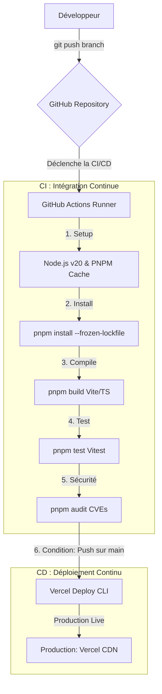

# Projet Président Online - Frontend

Ce dépôt contient l'interface utilisateur (Frontend) complète du jeu "Président Online". Elle est construite sous forme de Single Page Application (SPA) réactive avec Vue.js 3, Vite, Pinia, Tailwind CSS et TypeScript.

---

## 🛠️ 1. Démarrer le projet en mode Développement (Local)

### Prérequis
- [Node.js](https://nodejs.org/) (version 20 ou supérieure recommandée)
- [pnpm](https://pnpm.io/) (`npm install -g pnpm`)

### Installation et Démarrage

1. **Cloner le dépôt :**
   ```bash
   git clone git@github.com:joran-cng/detrones-front.git
   cd detrones-front
   ```

2. **Installer les dépendances :**
   À la racine du projet, installez toutes les dépendances :
   ```bash
   pnpm install
   ```

3. **Lancer le serveur de développement :**
   ```bash
   pnpm run dev
   ```
   L'application est maintenant accessible localement à l'adresse : [http://localhost:5173](http://localhost:5173).

---

## 🧪 2. Exécuter les tests unitaires localement

Les tests unitaires vérifient la logique des composants (champs de saisie, logique d'état, boutons) et sont propulsés par **Vitest**.

Pour exécuter les tests une fois :
```bash
pnpm test
```

Pour exécuter les tests en mode d'écoute interactive (watch mode) :
```bash
pnpm run test:unit
```

---

## 🔄 3. Pipeline CI/CD et Déploiement Continu

Le projet intègre une chaîne d'intégration et de déploiement continu automatisée avec **GitHub Actions**.

### Schéma de l'Architecture CI/CD



### Fonctionnement du Pipeline (`.github/workflows/deploy.yml`)

Le pipeline est configuré pour s'exécuter automatiquement à chaque modification de code :
*   **Sur les Pull Requests vers `main`** : Il exécute uniquement les phases d'Intégration Continue (Installation, Build, Tests unitaires et Audit de sécurité) pour s'assurer que la branche n'introduit aucune régression.
*   **Sur les Pushes directs ou Fusions sur `main`** : Il exécute toutes les étapes d'intégration, puis déploie automatiquement l'application compilée en production sur **Vercel** grâce à l'enchaînement de commandes `vercel --prebuilt`.

### Comment suivre les exécutions et les logs
1. Allez sur le dépôt GitHub du projet.
2. Cliquez sur l'onglet **Actions**.
3. Sélectionnez le workflow **CI/CD Frontend - VueJS** dans la barre latérale.
4. Cliquez sur le run en cours ou terminé pour voir l'avancement détaillé et les logs d'exécution de chaque étape.
